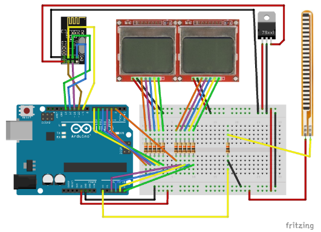
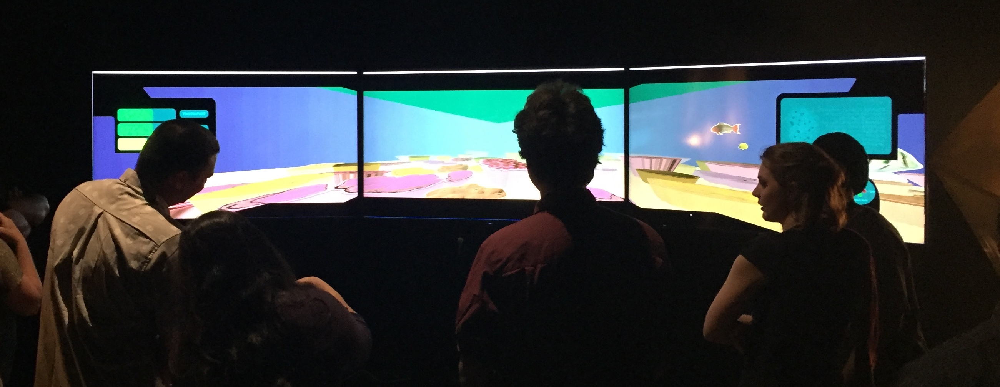
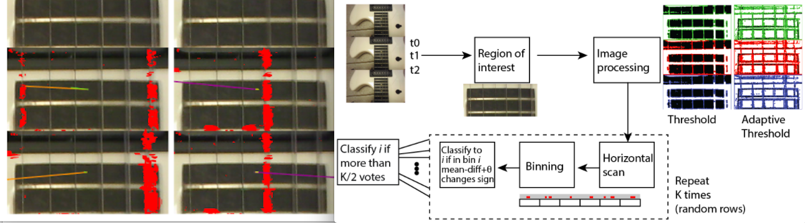
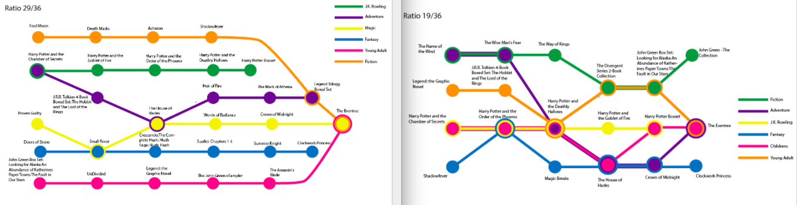
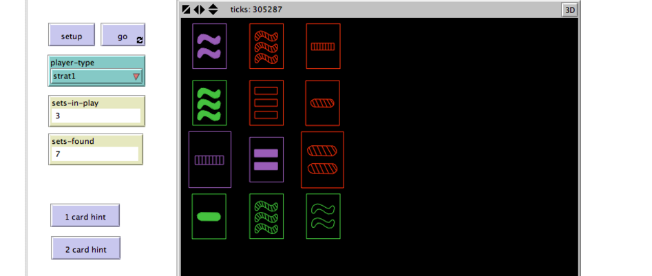

In this page I summaries some of the project work I did as a graduate student in the University of Hawaii at Manoa. The purpose is the keep links and images to materials that I have developed in the past and did not neccessarily continued working on. 

##### Spring 2017
EE 626 **Rapid Prototyping of Electrophysical Devices** - Hands on experience in designing, fabricating, testing, and iterating according to rapid-prototyping principles. Students learn state-of-the-art equipment for making their designs, software for simulating designs, and working in design teams.  
During this class I've developed the first prototype of interactive cards. The pitch for the project can be viewed in this [video](https://www.youtube.com/watch?v=ukhoxfLv9C8), the final submission is [here](https://drive.google.com/a/hawaii.edu/file/d/0B1JftKNBmtQlNXRnWUhYbzV2eEVWazVXMU9heHF6bDhZNVFJ/view?usp=sharing).

##### Fall 2016
CIS 703 **Communication/Information Research Methods** - Current research methodologies in decision sciences, computer science, library science, and communication. Emphasis on methodologies suitable for interdisciplinary analysis.  
In this class we covered the basics of research methodologies. We chose a topic and researched possible theoretical concepts to investigate. We designed both a quantitative and qualitative research experiments or studies for our chosen topic.

##### Spring 2016
ICS 484 **Data Visualization** - Introduction to data visualization through practical techniques for turning data into images to produce insight. Topics include: information visualization, geospatial visualization, scientific visualization, social network visualization, and medical visualization.  
In this class we were tasked with working in a multi-field team (scientist, artists, computer scientists) to create a simulation to illustrate some aspect of the scientists research. These projects were then shared as experiences to museum goers, shown on a wall of tvs, and controlled with an xbox controller. My group focused on some of the changes the environment (via temperature or rain) can affect water quality and thus livable conditions for corals. A demo video of our project can be found [here](https://youtu.be/wrMn19q3x6M).

ICS 651 **Computer Networks** - Elementary principles of modern computer networking. Detailed coverage of overall architecture and the physical, data link, and network layers, with emphasis on the network layer.  
In this class we worked in C. Our projects revolved around implementing network protocols, such as a making a simple IP router, implementing a TCP server and client, and handling HTTP messages.
	
##### Fall 2015
ICS 663 **Pattern Recognition** - Nature of the problem in pattern recognition and clustering; explanation of various algorithms.  
My project for this class was called "Using Computer Vision to Identify Strummed Guitar Strings" and in it I tried to detect using image processing if a guitar string has been displaced (and therefore likely strummed). The project proposal can be found [here](https://docs.google.com/a/hawaii.edu/presentation/d/19Jfd27RvYU1o6rIxTVM-ODeMOC0QddI8ZhduCqlL_zg/edit?usp=sharing), and the project's final presentation can be found [here](https://docs.google.com/a/hawaii.edu/presentation/d/1XZlnQ5-HKuYj0oW0SILHPCvxnmYTBZhen_B0CS0QGCk/edit?usp=sharing).

	

ICS 667 **HCI Design Methods** - Advanced analytical and empirical methods for the design and evaluation of usable, useful, and robust human-computer interfaces. Students will apply selected methodologies to a major system design project.  
In this class we reviewed current research into HCI design with modern tools such as probes. We worked as a group on the design of an educational kiosk about energy consumption and the advantages of solar energy.</li>

##### Spring 2015
ICS 622 **Network Science** - Modeling human-made and natural systems as networks to understand their structure and dynamics. Computational and statistical methods and research results they enabled. Use of network analysis software.  
In this class we learned about the different kinds of relationships in networks and how to recover interesting insights about the network using analysis (working in R). We applied the concepts learned in class on openly available databases.

ICS 624 **Advanced Data Management** - Exploration of information retrieval and object-relational tools and methods for the management of distributed multimedia database systems.  
In this class we followed current research into data-systems and data analysis. My project involved a recommendation system for books using a metro-map form of data visualizing. This form was used in recent research to visualize other forms of media, namely, news and academic articles. For this work I have scraped data from the site goodreads (this was a small data set of 2,500 books from 250 authors). My final presentation is [here](https://docs.google.com/presentation/d/1lIOLv5s8N6GSVLHV_d13pOyYCE5r5W1muG8AuQUUl_U/edit?usp=sharing).

	

##### Fall 2014
ICS 606 **Intelligent Autonomous Agents** - Theory, methods and practical applications of autonomous agent systems, including common applications of both software and hardware (robotic) agents. In-depth practical experience with autonomous agents through programming assignments and projects.  
For this class I worked on making a simulation in NetLogo of cards for the game SET as they try to detect via communication how many sets are currently available. This project helped me get acquainted with the NetLogo environment, whose purpose is to help model autonomous agents systems. The project was demoed in a [video](https://www.youtube.com/watch?v=0b7ueUZ0Pk8), the final presentation is [here](https://docs.google.com/a/hawaii.edu/presentation/d/1_O-MOjRvwF6MhdIS127gajKaTOcPUERij4LOqQVWq6E/edit?usp=sharing).

ICS 664 **Human-Computer Interaction II** - Studies of human performance in designing and using information systems. Emphasizes concepts and methodologies from human factors, psychology, and software engineering relating to human performance.  
In this class, our coursework involved designing, evaluating (from user's standpoint) and conducting user testing on a system. My group chose to work in a system that would integrate smart parking guidance in a parking lot (using guiding lights embedded in floor). Our presentations on the project can be found [here](https://docs.google.com/presentation/d/1RTyipfrpCJksOa51NvFlzCcFv5a4-AVTAxMQLeaNwR0/edit?usp=sharing), [here](https://docs.google.com/presentation/d/1M5d9fxXjcpOU2H4KR7yXtotAU2w99Am-8w8q_2sVfY8/edit?usp=sharing), and [here](https://docs.google.com/presentation/d/1UNhQSdkrmuEhjJQxe7cJ0MO2VZIuWQs0sN8fI85B4EM/edit?usp=sharing).

ICS 665 **User Interfaces and Hypermedia** - Advanced concepts in construction of interfaces between computers and their users. Hypermedia information structures, guidelines, problems, and tradeoffs. Discussion of selected readings, implementation of prototypes.  
In this class we summaries reading and viewing materials relating to the topic, and suggested some design ideas to solve problems. My project pitch can be found [here](https://docs.google.com/a/hawaii.edu/presentation/d/1ybAsZI7IJBrP0kFcEO0z1VejGNeyD8VmtAoQIYEtGxY/edit?usp=sharing) and the final presentation [here](https://docs.google.com/a/hawaii.edu/presentation/d/1SLxF16dBLsN8RWuVijJXsyh6_Ys0eJW8DkeBPRfnyVo/edit?usp=sharing), this project was only partially implemented.
