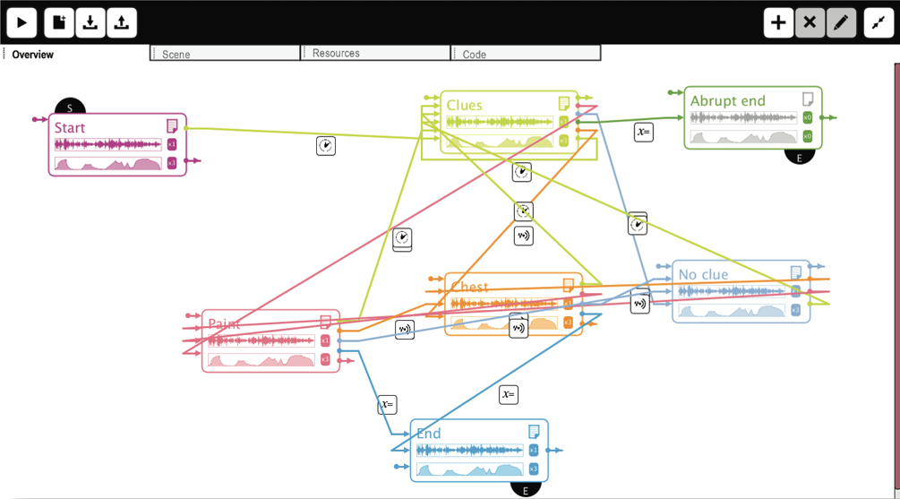
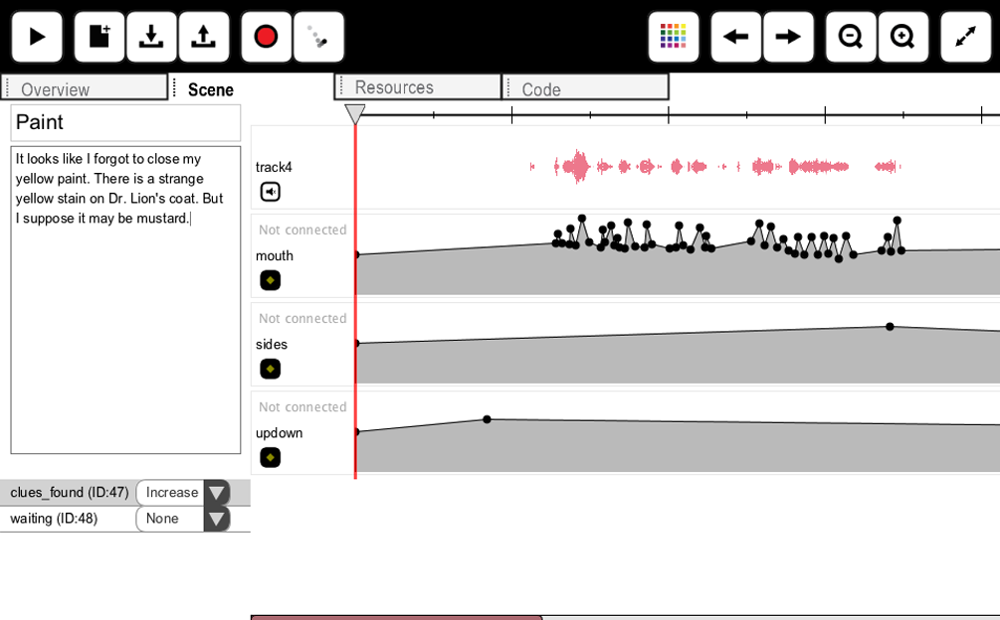
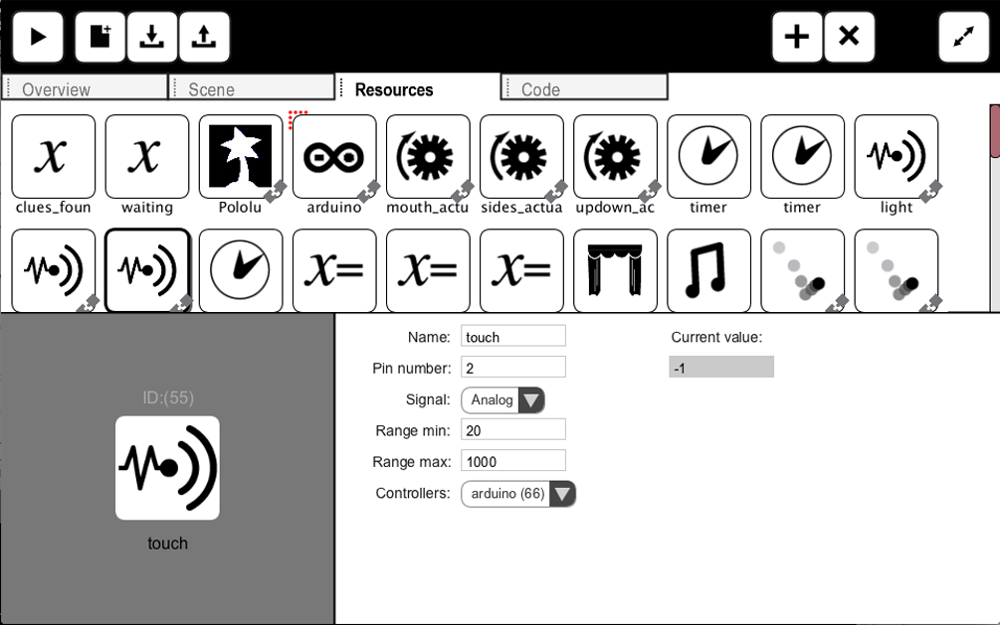
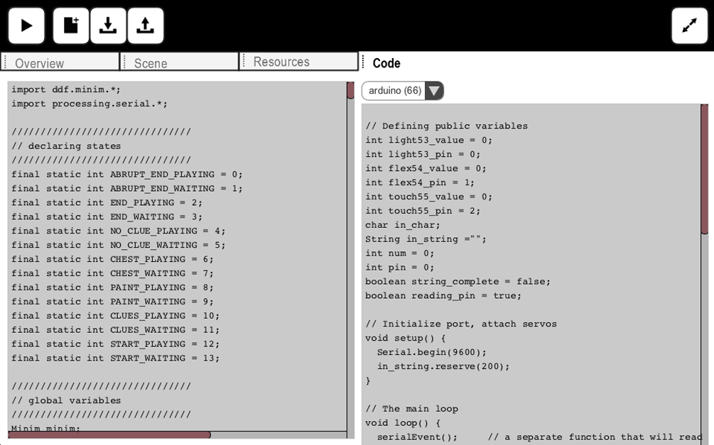

  
  
  
  

Through the creation of animatronic puppet shows, students are exposed to hands-on activities that can help them learn about both technology and storytelling. These activities include designing a character, writing a script, designing a set as well as constructing the puppet, building the set, and editing sound and actuators' movements. Show-Flow is a tool for authoring and playing animatronic puppet shows. It was designed to help creating complex non-linear narratives using an important paradigm from Computer Science - the Finite State Machine. The tool has 4 components.

## Orchestrate the Flow of the Show:
Show-Flow helps you describe your show as a state machine. Each scene is a state. The show transitions from one scene to another when events are triggered. Events can rely on timers, sensors, or variables. In the "Overview" tab, you can use a drag and drop interface to create this state machine.

## Create a Scene:
Show-Flow aims to be a one-stop tool for the show creators. In the "Scene" tab, you can rename the scene, write a text for the scene, record an audio file or drag in an existing file, add animation tracks and edit them using keyframes, and playback the scene until it is perfected.

## Manage Resources:
Show-Flow makes all the resources used by the project easy to create and modify. In the "Resources" tab, you can create resources for controllers (Pololu or Arduino), actuators, and sensors. You can calibrate the values issued to actuators or triggered by sensors. You can drag and drop resources to quickly associate them.

## Start a CS Conversation:
Show-Flow was envisioned to be an educational tool which encourages creativity as well as learning new skills and technologies. In the "Code" tab, you will find Processing code for running the show without Show- flow. This can start a Computer Science conversation about state machines and how they can be used in programs that depend on interactivity, such as games.

